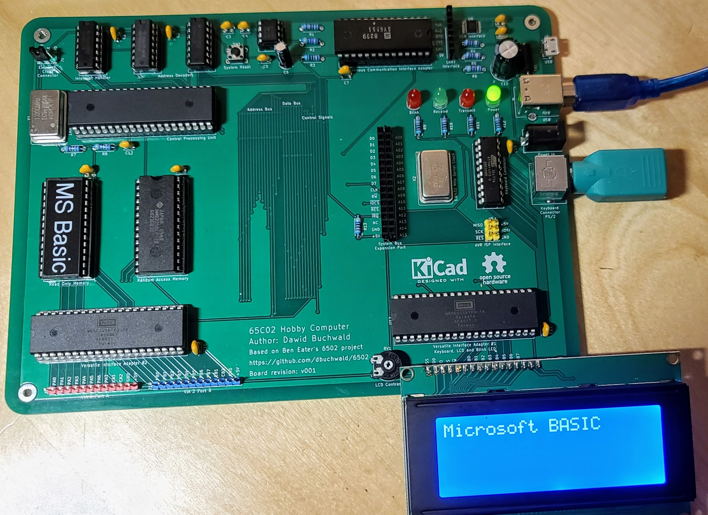

# 8-Bit 65C02 based Computer

This repository contains assembly code for the 65C02 based 8-bit computer I am
building on a breadboard. I started out writing the assembly and compiling it
using [vasm](http://sun.hasenbraten.de/vasm/) because it is portable to many
different CPUs including the Z80 which I also program for. I recently switched
to using [cc65](https://cc65.github.io/) because it allows me to specify the
[memory layout](65C02.cfg) of this machine and ships with the memory layouts
of many more machines like the VIC20, C64, Commander X16, Atari consoles, etc.

The breadboard version of this computer is based on the design by
[Ben Eater](https://eater.net/6502). If you are interested in following along,
I highly recommend his video series.

After completing the breadboard version, I found an updated version with two VIA
chips, a 6551 based ACIA chip for serial communications and a PS/2 keyboard port
with an ATtiny4313 based keyboard controller by
[Dawid Buchwald](https://github.com/dbuchwald/6502) who writes about the
[designing the computer on Hackaday.io](https://hackaday.io/project/174128/logs?sort=oldest).

I had boards made by PCBWay.com and built a version of the computer based on David's
design. Much of the software here started out being written by David.

## 16x2 LCD addressing scheme

|   |   |   |   |   |   |
|---|---|---|---|---|---|
|0x00|0x01|0x02|0x03|...|0x0F|
|0x40|0x41|0x42|0x43|...|0x4F|

## 20x4 LCD addressing scheme

|   |   |   |   |   |   |
|---|---|---|---|---|---|
|0x00|0x01|0x02|0x03|...|0x13|
|0x40|0x41|0x42|0x43|...|0x53|
|0x14|0x15|0x16|0x17|...|0x28|
|0x53|0x54|0x55|0x56|...|0x68|
