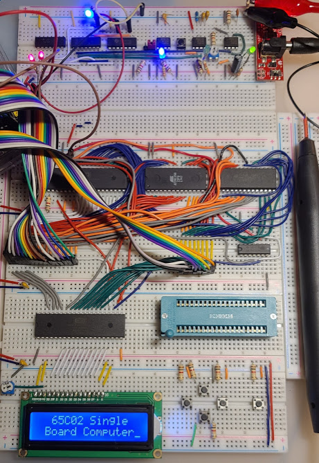

# 8-Bit 65C02 based Computer

This repository contains assembly code for the 65C02 based 8-bit computer I am
building on a breadboard. I started out writing the assembly and compiling it
using [vasm](http://sun.hasenbraten.de/vasm/) because it is portable to many
different CPUs including the Z80 which I also program for. I recently switched
to using [cc65](https://cc65.github.io/) because it allows me to specify the
[memory layout](65C02.cfg) of this machine and ships with the memory layouts
of many more machines like the VIC20, C64, Commander X16, Atari consoles, etc.

The computer itself is based on the design by [Ben Eater](https://eater.net/6502).
If you are interested in following along, I highly recommend his video series.

This computer has 32K RAM in the lower address space and a 32K ROM in the upper
half of the 64K address space. It is a 65C02 CPU, so the first 256 bytes of RAM
are Zero Page (ZP), the second 256 bytes are for the stack.

After the computer boots, the reset button must be pressed. I plan on added a
power on reset circuit based on the one from the C64 but that is not complete.

After reset, the CPU reads from address 0x7FFC and jumps to the address
contained there. Eventually I would like to load [Tiny BASIC](https://en.wikipedia.org/wiki/Tiny_BASIC)
or a version of [Microsoft BASIC](https://www.pagetable.com/?p=46) into the ROM
and launch that, but for now, it just jumps to a program in ROM and executes it.

- The top board is the clock circuit based on 555 timers. The clock can be
adjusted or you can single step the clock.
- The board with three chips, [65C02](https://westerndesigncenter.com/wdc/documentation/w65c02s.pdf)
CPU on the left, [AT28C256](http://ww1.microchip.com/downloads/en/DeviceDoc/doc0006.pdf)
32K EEPROM center and [HM62256](https://datasheetspdf.com/pdf/544610/Hitachi/HM62256LP/1)
32K RAM left
- The ribbon cables are the 16 bit address bus and 8 bit data bus going to an
Arduino Mega that I use to monitor the addresses and data on the bus.
- Second board from the bottom is the [65C22](http://archive.6502.org/datasheets/wdc_w65c22s_mar_2004.pdf) Versatile Interface Adapter (VIA)
- The bottom breadboard is for I/O with an [HD44780U](https://www.sparkfun.com/datasheets/LCD/HD44780.pdf)
based 16x2 LCD display and currently 5 push buttons for input.
- The pen on the right is an [LP-560 logic probe](https://www.elenco.com/wp-content/uploads/2017/10/LP560-3.pdf) for testing the circuit.